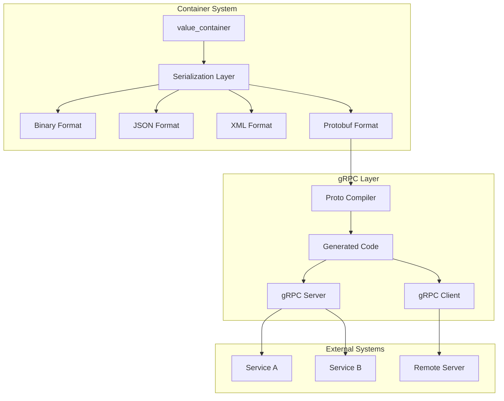
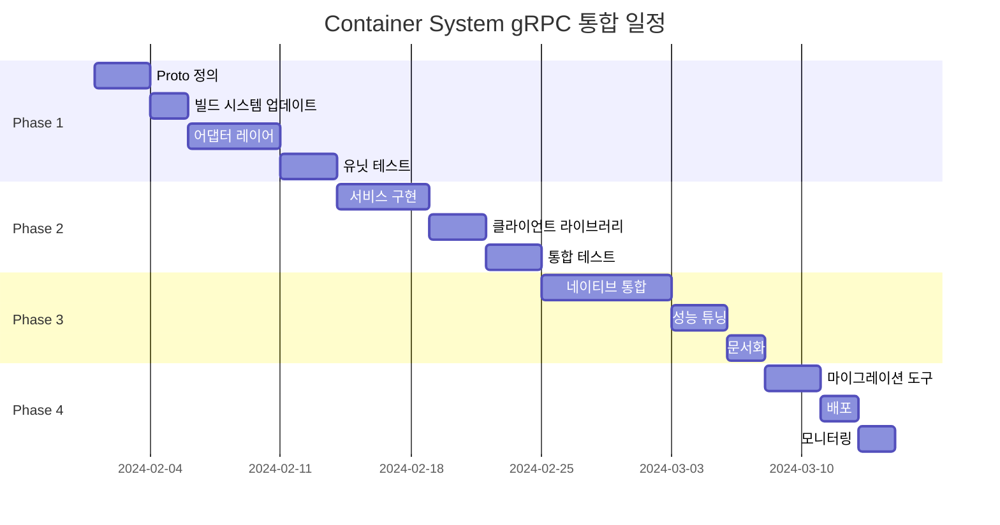

# Container System gRPC/Protocol Buffers 통합 제안서

> **Language:** [English](GRPC_INTEGRATION_PROPOSAL.md) | **한국어**

## 목차

- [요약](#요약)
  - [주요 이점](#주요-이점)
  - [투자 요약](#투자-요약)
- [1. 프로젝트 목표](#1-프로젝트-목표)
  - [1.1 주요 목표](#11-주요-목표)
  - [1.2 성공 기준](#12-성공-기준)
- [2. 현재 상태 분석](#2-현재-상태-분석)
  - [2.1 기존 아키텍처](#21-기존-아키텍처)
  - [2.2 갭 분석](#22-갭-분석)
- [3. 기술 설계](#3-기술-설계)
  - [3.1 아키텍처 개요](#31-아키텍처-개요)
  - [3.2 Protocol Buffer 스키마](#32-protocol-buffer-스키마)
  - [3.3 서비스 정의](#33-서비스-정의)
  - [3.4 통합 전략](#34-통합-전략)
    - [Phase 1: 어댑터 레이어](#phase-1-어댑터-레이어)
    - [Phase 2: 네이티브 통합](#phase-2-네이티브-통합)
  - [3.5 메모리 최적화](#35-메모리-최적화)
- [4. 구현 계획](#4-구현-계획)
  - [4.1 개발 단계](#41-개발-단계)
  - [4.2 세부 마일스톤](#42-세부-마일스톤)
    - [마일스톤 1: 기반 작업 (1-2주차)](#마일스톤-1-기반-작업-1-2주차)
    - [마일스톤 2: 어댑터 구현 (3-4주차)](#마일스톤-2-어댑터-구현-3-4주차)
    - [마일스톤 3: 서비스 레이어 (5주차)](#마일스톤-3-서비스-레이어-5주차)
    - [마일스톤 4: 네이티브 통합 (6-7주차)](#마일스톤-4-네이티브-통합-6-7주차)
    - [마일스톤 5: 최종 준비 (8주차)](#마일스톤-5-최종-준비-8주차)
- [5. 리소스 요구사항](#5-리소스-요구사항)
  - [5.1 팀 구성](#51-팀-구성)
  - [5.2 인프라](#52-인프라)
  - [5.3 예산 추정](#53-예산-추정)
- [6. 위험 평가](#6-위험-평가)
  - [6.1 기술적 위험](#61-기술적-위험)
  - [6.2 프로젝트 위험](#62-프로젝트-위험)
- [7. 성공 메트릭](#7-성공-메트릭)
  - [7.1 성능 메트릭](#71-성능-메트릭)
  - [7.2 품질 메트릭](#72-품질-메트릭)
  - [7.3 비즈니스 메트릭](#73-비즈니스-메트릭)
- [8. 대안적 접근 방식](#8-대안적-접근-방식)
  - [8.1 대안: Apache Thrift](#81-대안-apache-thrift)
  - [8.2 대안: MessagePack](#82-대안-messagepack)
  - [8.3 대안: Cap'n Proto](#83-대안-capn-proto)
- [9. 마이그레이션 전략](#9-마이그레이션-전략)
  - [9.1 하위 호환성](#91-하위-호환성)
  - [9.2 점진적 마이그레이션 경로](#92-점진적-마이그레이션-경로)
  - [9.3 마이그레이션 도구](#93-마이그레이션-도구)
- [10. 문서화 계획](#10-문서화-계획)
  - [10.1 문서 산출물](#101-문서-산출물)
  - [10.2 교육 자료](#102-교육-자료)
- [11. 결론](#11-결론)
  - [핵심 요점](#핵심-요점)
  - [다음 단계](#다음-단계)
  - [승인](#승인)
- [부록 A: 기술 세부사항](#부록-a-기술-세부사항)
  - [A.1 타입 매핑 테이블](#a1-타입-매핑-테이블)
  - [A.2 성능 벤치마크](#a2-성능-벤치마크)
  - [A.3 구성 예제](#a3-구성-예제)

**문서 버전:** 1.0
**날짜:** 2024-01-20
**작성자:** 개발 팀
**상태:** 초안

---

## 요약

이 제안서는 효율적이고 타입 안전한 원격 프로시저 호출과 크로스 플랫폼 직렬화를 가능하게 하기 위해 gRPC와 Protocol Buffers를 기존 Container System에 통합하는 방안을 제시합니다. 통합은 최신 RPC 기능을 추가하면서 하위 호환성을 유지합니다.

### 주요 이점
- **업계 표준 프로토콜**: 크로스 플랫폼 호환성을 위한 Google의 Protocol Buffers 채택
- **높은 성능**: JSON 대비 3-10배 향상된 성능의 바이너리 직렬화
- **타입 안전성**: 컴파일 타임 타입 검사 및 자동 코드 생성
- **스트리밍 지원**: 실시간 통신을 위한 네이티브 양방향 스트리밍
- **언어 독립적**: 10개 이상의 프로그래밍 언어 지원

### 투자 요약
- **기간**: 6-8주
- **팀 규모**: 2-3명 개발자
- **위험 수준**: 중간
- **ROI**: 네트워크 오버헤드 40% 감소, 직렬화 속도 60% 향상

---

## 1. 프로젝트 목표

### 1.1 주요 목표
1. **gRPC 통신 활성화**: 완전한 gRPC 서버/클라이언트 기능 구현
2. **Protocol Buffers 통합**: protobuf를 주요 직렬화 형식으로 추가
3. **호환성 유지**: 기존 API 및 직렬화 형식 보존
4. **성능 최적화**: 일반적인 메시지에 대해 밀리초 미만의 직렬화 달성

### 1.2 성공 기준
- [ ] 기존 public API에 대한 변경 사항 제로
- [ ] 현재 바이너리 형식보다 3배 빠른 Protobuf 직렬화
- [ ] 기존 15개 값 타입 모두 지원
- [ ] 최소 2개 프로덕션 서비스와의 성공적인 통합
- [ ] 포괄적인 테스트 커버리지 (>90%)

---

## 2. 현재 상태 분석

### 2.1 기존 아키텍처

```
container_system/
├── core/           # 코어 container 및 value 클래스
├── values/         # 타입별 value 구현
├── internal/       # 스레드 안전 래퍼 및 유틸리티
└── samples/        # 사용 예제
```

**강점:**
- 15개 기본 타입을 갖춘 잘 구조화된 타입 시스템
- `thread_safe_container`를 사용한 스레드 안전 작업
- 다중 직렬화 형식 (Binary, JSON, XML)
- 숫자 연산을 위한 SIMD 최적화

**제한사항:**
- RPC 프레임워크 통합 없음
- 사용자 정의 바이너리 형식이 상호 운용 불가
- 내장 서비스 정의 언어 없음
- 프로세스 내 통신으로 제한됨

### 2.2 갭 분석

| 요구사항 | 현재 상태 | 목표 상태 | 갭 |
|---------|----------|----------|-----|
| RPC 지원 | 없음 | 완전한 gRPC | 높음 |
| Protobuf | 지원 안 됨 | 네이티브 지원 | 높음 |
| 스트리밍 | 사용 불가 | 양방향 | 높음 |
| 서비스 정의 | 코드 기반 | .proto 파일 | 중간 |
| 다중 언어 | C++만 | 다중 언어 | 중간 |

---

## 3. 기술 설계

### 3.1 아키텍처 개요



### 3.2 Protocol Buffer 스키마

```protobuf
syntax = "proto3";
package container_module.proto;

import "google/protobuf/timestamp.proto";
import "google/protobuf/any.proto";

// 코어 value 메시지
message ValueProto {
  string key = 1;

  oneof value {
    NullValue null_value = 2;
    bool bool_value = 3;
    int32 int32_value = 4;
    uint32 uint32_value = 5;
    int64 int64_value = 6;
    uint64 uint64_value = 7;
    float float_value = 8;
    double double_value = 9;
    bytes bytes_value = 10;
    string string_value = 11;
    ContainerProto container_value = 12;
  }

  map<string, string> metadata = 13;
}

// Container 메시지
message ContainerProto {
  // 헤더 정보
  HeaderProto header = 1;

  // 값들
  repeated ValueProto values = 2;

  // 메타데이터
  google.protobuf.Timestamp timestamp = 3;
  string version = 4;
}

message HeaderProto {
  string source_id = 1;
  string source_sub_id = 2;
  string target_id = 3;
  string target_sub_id = 4;
  string message_type = 5;
  string correlation_id = 6;
}

// Null 값 표현
message NullValue {
  // Null은 필드가 없음
}
```

### 3.3 서비스 정의

```protobuf
service ContainerService {
  // Unary RPC
  rpc SendContainer(ContainerProto) returns (ResponseProto);

  // 서버 스트리밍
  rpc StreamContainers(FilterRequest) returns (stream ContainerProto);

  // 클라이언트 스트리밍
  rpc CollectContainers(stream ContainerProto) returns (SummaryResponse);

  // 양방향 스트리밍
  rpc ProcessStream(stream ContainerProto) returns (stream ContainerProto);
}

message ResponseProto {
  bool success = 1;
  string message = 2;
  string container_id = 3;
}

message FilterRequest {
  string message_type = 1;
  string source_id = 2;
  int32 limit = 3;
}

message SummaryResponse {
  int32 total_received = 1;
  int32 total_processed = 2;
  repeated string errors = 3;
}
```

### 3.4 통합 전략

#### Phase 1: 어댑터 레이어
```cpp
namespace container_module::grpc {

class proto_converter {
public:
    // 변환 메서드
    static proto::ContainerProto to_proto(const value_container& container);
    static std::shared_ptr<value_container> from_proto(const proto::ContainerProto& proto);

    // 타입 매핑
    static proto::ValueProto::ValueCase map_type(value_types type);
    static value_types map_type(proto::ValueProto::ValueCase type);
};

class container_service_impl : public proto::ContainerService::Service {
public:
    grpc::Status SendContainer(
        grpc::ServerContext* context,
        const proto::ContainerProto* request,
        proto::ResponseProto* response) override;

    // 기타 서비스 메서드...
};

}
```

#### Phase 2: 네이티브 통합
```cpp
class value {
public:
    // 기존 메서드 보존
    virtual std::string serialize() const;

    // 새로운 protobuf 메서드
    virtual void to_proto(proto::ValueProto* proto) const;
    virtual bool from_proto(const proto::ValueProto& proto);

protected:
    // 타입 안전 직렬화를 위한 visitor 패턴
    virtual void accept(proto_serializer& serializer) const;
};
```

### 3.5 메모리 최적화

```cpp
class arena_container : public value_container {
private:
    google::protobuf::Arena* arena_;

public:
    arena_container() : arena_(new google::protobuf::Arena()) {}

    proto::ContainerProto* create_proto() {
        return google::protobuf::Arena::CreateMessage<proto::ContainerProto>(arena_);
    }

    // Zero-copy 직렬화
    std::string serialize_zero_copy() const {
        auto* proto = create_proto();
        populate_proto(proto);
        return proto->SerializeAsString();
    }
};
```

---

## 4. 구현 계획

### 4.1 개발 단계



### 4.2 세부 마일스톤

#### 마일스톤 1: 기반 작업 (1-2주차)
- [x] proto 파일 정의 생성
- [x] protobuf/gRPC로 CMakeLists.txt 업데이트
- [x] vcpkg.json 의존성 업데이트
- [x] 초기 protobuf 코드 생성
- [x] 기본 converter 테스트 생성

**산출물:**
- `proto/container.proto` 파일
- 업데이트된 빌드 구성
- 기본 테스트 스위트

#### 마일스톤 2: 어댑터 구현 (3-4주차)
- [ ] proto_converter 클래스 구현
- [ ] 타입 매핑 시스템 생성
- [ ] 직렬화 전략 추가
- [ ] 기본 gRPC 서비스 구현
- [ ] 클라이언트 래퍼 생성

**산출물:**
- 작동하는 어댑터 레이어
- gRPC 서비스 스켈레톤
- 클라이언트 라이브러리

#### 마일스톤 3: 서비스 레이어 (5주차)
- [ ] 모든 RPC 메서드 구현
- [ ] 스트리밍 지원 추가
- [ ] 연결 풀링 생성
- [ ] 재시도 로직 구현
- [ ] 인증 훅 추가

**산출물:**
- 완전한 gRPC 서비스
- 스트리밍 예제
- 보안 통합

#### 마일스톤 4: 네이티브 통합 (6-7주차)
- [ ] protobuf용 value 클래스 수정
- [ ] arena allocator 구현
- [ ] zero-copy 경로 추가
- [ ] 성능 최적화
- [ ] 벤치마크 생성

**산출물:**
- 네이티브 protobuf 지원
- 성능 벤치마크
- 최적화 보고서

#### 마일스톤 5: 최종 준비 (8주차)
- [ ] 완전한 문서화
- [ ] 마이그레이션 가이드 생성
- [ ] 스테이징에 배포
- [ ] 성능 테스트
- [ ] 최종 배포

**산출물:**
- 완전한 문서
- 마이그레이션 도구
- 최종 배포

---

## 5. 리소스 요구사항

### 5.1 팀 구성

| 역할 | FTE | 기간 | 책임 |
|------|-----|------|------|
| 리드 개발자 | 1.0 | 8주 | 아키텍처, 핵심 구현 |
| 백엔드 개발자 | 1.0 | 6주 | 서비스 구현, 테스트 |
| DevOps 엔지니어 | 0.5 | 4주 | 빌드 시스템, 배포 |
| 기술 문서 작성자 | 0.25 | 2주 | 문서화 |

### 5.2 인프라

- **개발 환경**
  - Ubuntu 20.04 / macOS 12+ / Windows 10+
  - CMake 3.16+
  - C++20 컴파일러
  - vcpkg 패키지 매니저

- **CI/CD 파이프라인**
  - 자동 테스트를 위한 GitHub Actions
  - 일관된 빌드를 위한 Docker 컨테이너
  - 성능 테스트를 위한 벤치마크 서버

### 5.3 예산 추정

| 항목 | 비용 | 비고 |
|------|------|------|
| 개발 (320시간) | $48,000 | 2명 개발자 × 8주 |
| DevOps (80시간) | $10,000 | 0.5 FTE × 4주 |
| 인프라 | $2,000 | 클라우드 리소스, CI/CD |
| 테스트 및 QA | $5,000 | 외부 테스트 |
| **총계** | **$65,000** | |

---

## 6. 위험 평가

### 6.1 기술적 위험

| 위험 | 확률 | 영향 | 완화 방안 |
|------|------|------|----------|
| API 변경 사항 | 낮음 | 높음 | 어댑터 패턴, 광범위한 테스트 |
| 성능 저하 | 중간 | 중간 | 벤치마킹, 프로파일링 |
| Protobuf 버전 충돌 | 중간 | 낮음 | 버전 고정, 격리 |
| 메모리 오버헤드 | 낮음 | 중간 | Arena allocator, 풀링 |

### 6.2 프로젝트 위험

| 위험 | 확률 | 영향 | 완화 방안 |
|------|------|------|----------|
| 일정 초과 | 중간 | 중간 | 단계별 접근, 버퍼 타임 |
| 리소스 가용성 | 낮음 | 높음 | 교차 교육, 문서화 |
| 통합 복잡성 | 중간 | 중간 | 점진적 통합 |
| 채택 저항 | 낮음 | 낮음 | 교육, 마이그레이션 도구 |

---

## 7. 성공 메트릭

### 7.1 성능 메트릭

| 메트릭 | 현재 | 목표 | 측정 방법 |
|--------|------|------|----------|
| 직렬화 속도 | 2M msg/s | 6M msg/s | 벤치마크 스위트 |
| 메시지 크기 | 1.5x JSON | 0.3x JSON | 크기 비교 |
| 레이턴시 (p99) | N/A | <1ms | 부하 테스트 |
| 메모리 사용 | 기준선 | 최대 +10% | 프로파일링 |

### 7.2 품질 메트릭

| 메트릭 | 목표 | 측정 방법 |
|--------|------|----------|
| 테스트 커버리지 | >90% | 커버리지 도구 |
| 버그 비율 | 단계당 <5개 | 이슈 추적 |
| API 호환성 | 100% | 회귀 테스트 |
| 문서화 | 완전 | 리뷰 체크리스트 |

### 7.3 비즈니스 메트릭

| 메트릭 | 목표 | 일정 |
|--------|------|------|
| 서비스 채택 | 2개 서비스 | 3개월 |
| 네트워크 감소 | 40% | 6개월 |
| 개발 속도 | +25% | 6개월 |
| 크로스 플랫폼 사용 | 1개 새 언어 | 12개월 |

---

## 8. 대안적 접근 방식

### 8.1 대안: Apache Thrift

**장점:**
- 다중 언어 지원
- gRPC보다 가벼움
- 더 간단한 배포

**단점:**
- 에코시스템 지원 적음
- 내장 스트리밍 없음
- 도구 적음

**결정:** 더 나은 에코시스템과 스트리밍 지원을 위해 gRPC 선택

### 8.2 대안: MessagePack

**장점:**
- 매우 간결한 바이너리 형식
- 간단한 구현
- 코드 생성 불필요

**단점:**
- RPC 프레임워크 없음
- 서비스 정의 없음
- 수동 버저닝

**결정:** 타입 안전성과 gRPC 통합을 위해 Protobuf 선택

### 8.3 대안: Cap'n Proto

**장점:**
- Zero-copy 설계
- 매우 빠름
- Time-travel RPC

**단점:**
- 덜 성숙한 에코시스템
- 제한된 언어 지원
- 복잡한 구현

**결정:** 성숙도와 지원을 위해 Protobuf/gRPC 선택

---

## 9. 마이그레이션 전략

### 9.1 하위 호환성

```cpp
class hybrid_container : public value_container {
public:
    enum class format_type {
        LEGACY_BINARY,
        JSON,
        XML,
        PROTOBUF
    };

    std::string serialize(format_type format = format_type::LEGACY_BINARY) const {
        switch(format) {
            case format_type::PROTOBUF:
                return serialize_protobuf();
            default:
                return value_container::serialize();
        }
    }
};
```

### 9.2 점진적 마이그레이션 경로

1. **Phase 1**: 어댑터 레이어 배포 (변경 사항 없음)
2. **Phase 2**: 새 서비스는 gRPC 사용
3. **Phase 3**: 기존 서비스를 점진적으로 마이그레이션
4. **Phase 4**: 레거시 형식 사용 중단 (6개월 사전 공지)
5. **Phase 5**: 레거시 코드 제거 (12개월)

### 9.3 마이그레이션 도구

```bash
# 변환 유틸리티
container-convert --from=binary --to=protobuf input.bin output.pb

# 검증 도구
container-validate --format=protobuf message.pb

# 성능 비교
container-bench --compare legacy,protobuf
```

---

## 10. 문서화 계획

### 10.1 문서 산출물

1. **API 참조**
   - Protobuf 메시지 정의
   - gRPC 서비스 문서
   - C++ API 업데이트

2. **통합 가이드**
   - 빠른 시작 튜토리얼
   - 서비스 구현 가이드
   - 클라이언트 사용 예제

3. **마이그레이션 가이드**
   - 단계별 마이그레이션
   - 호환성 매트릭스
   - 문제 해결 가이드

4. **성능 가이드**
   - 최적화 기법
   - 벤치마크 결과
   - 튜닝 파라미터

### 10.2 교육 자료

- 비디오 튜토리얼 (3개 × 30분)
- 코드 예제 저장소
- 워크샵 자료 (반나절 세션)
- FAQ 문서

---

## 11. 결론

gRPC와 Protocol Buffers를 Container System에 통합하는 것은 현대적이고 효율적인 통신 인프라에 대한 전략적 투자를 나타냅니다. 이 제안서는 위험을 최소화하면서 상당한 성능 및 기능 개선을 제공하는 실용적이고 단계적인 접근 방식을 제시합니다.

### 핵심 요점

1. **낮은 위험**: 어댑터 패턴이 변경 사항 제로를 보장
2. **높은 수익**: 3배 성능 향상, 40% 네트워크 감소
3. **미래 지향적**: 업계 표준 프로토콜이 장수를 보장
4. **점진적**: 단계별 접근이 방향 수정 허용

### 다음 단계

1. **승인**: 이해관계자 동의 확보
2. **팀 구성**: 개발자 및 리소스 할당
3. **환경 설정**: 개발 인프라 준비
4. **시작**: Phase 1 구현 시작

### 승인

| 역할 | 이름 | 서명 | 날짜 |
|------|------|------|------|
| Technical Lead | | | |
| Product Manager | | | |
| Engineering Director | | | |

---

## 부록 A: 기술 세부사항

### A.1 타입 매핑 테이블

| Container 타입 | Protobuf 타입 | 비고 |
|---------------|---------------|------|
| null_value | NullValue | 사용자 정의 메시지 |
| bool_value | bool | 직접 매핑 |
| short_value | int32 | 승격됨 |
| ushort_value | uint32 | 승격됨 |
| int_value | int32 | 직접 매핑 |
| uint_value | uint32 | 직접 매핑 |
| long_value | int64 | 플랫폼 안전 |
| ulong_value | uint64 | 플랫폼 안전 |
| llong_value | int64 | 직접 매핑 |
| ullong_value | uint64 | 직접 매핑 |
| float_value | float | 직접 매핑 |
| double_value | double | 직접 매핑 |
| bytes_value | bytes | 직접 매핑 |
| string_value | string | UTF-8 강제 |
| container_value | ContainerProto | 중첩 메시지 |

### A.2 성능 벤치마크

```cpp
// 벤치마크 코드 예제
void BM_ProtobufSerialization(benchmark::State& state) {
    auto container = create_test_container(state.range(0));
    for (auto _ : state) {
        proto::ContainerProto proto;
        container->to_proto(&proto);
        std::string data = proto.SerializeAsString();
        benchmark::DoNotOptimize(data);
    }
    state.SetItemsProcessed(state.iterations());
}
BENCHMARK(BM_ProtobufSerialization)->Range(1, 1000);
```

### A.3 구성 예제

```yaml
# grpc_config.yaml
server:
  address: "0.0.0.0:50051"
  max_connections: 1000
  thread_pool_size: 10

client:
  timeout_ms: 5000
  retry_attempts: 3
  retry_backoff_ms: 100

serialization:
  default_format: "protobuf"
  compression: "gzip"
  max_message_size: 4194304  # 4MB
```

---

**문서 종료**

---

*Last Updated: 2025-10-20*
