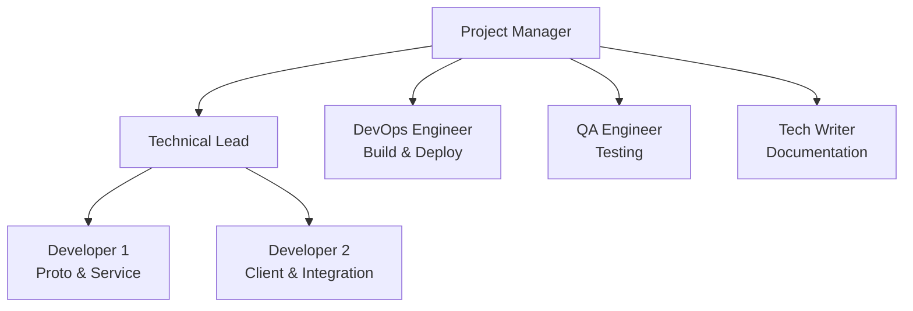
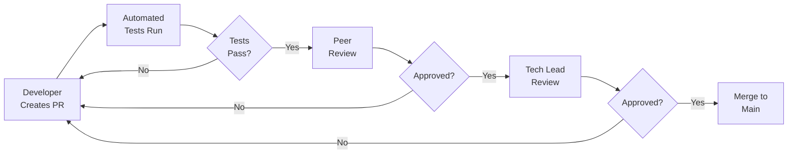
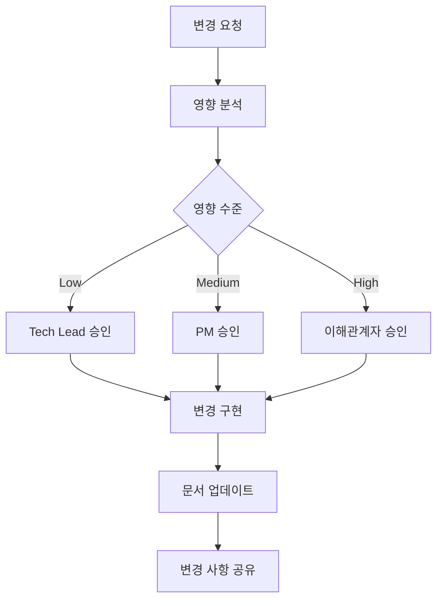

# Container System gRPC 통합 - 프로젝트 계획

> **Language:** [English](GRPC_PROJECT_PLAN.md) | **한국어**

## 목차

- [1. 프로젝트 헌장](#1-프로젝트-헌장)
  - [1.1 프로젝트 비전](#11-프로젝트-비전)
  - [1.2 프로젝트 범위](#12-프로젝트-범위)
  - [1.3 이해관계자](#13-이해관계자)
- [2. 작업 분해 구조 (WBS)](#2-작업-분해-구조-wbs)
- [3. 상세 작업 일정](#3-상세-작업-일정)
  - [1주차: 기초 설정 (2월 1-7일)](#1주차-기초-설정-2월-1-7일)
  - [2주차: Proto 구현 (2월 8-14일)](#2주차-proto-구현-2월-8-14일)
  - [3주차: 서비스 개발 (2월 15-21일)](#3주차-서비스-개발-2월-15-21일)
  - [4주차: 클라이언트 개발 (2월 22-28일)](#4주차-클라이언트-개발-2월-22-28일)
  - [5주차: 네이티브 통합 (2월 29일 - 3월 6일)](#5주차-네이티브-통합-2월-29일---3월-6일)
  - [6주차: 최적화 (3월 7-13일)](#6주차-최적화-3월-7-13일)
  - [7주차: 테스팅 및 문서화 (3월 14-20일)](#7주차-테스팅-및-문서화-3월-14-20일)
  - [8주차: 배포 (3월 21-28일)](#8주차-배포-3월-21-28일)
- [4. 자원 할당](#4-자원-할당)
  - [4.1 팀 구조](#41-팀-구조)
  - [4.2 자원 로딩](#42-자원-로딩)
- [5. 리스크 관리 계획](#5-리스크-관리-계획)
  - [5.1 리스크 등록부](#51-리스크-등록부)
  - [5.2 비상 계획](#52-비상-계획)
- [6. 커뮤니케이션 계획](#6-커뮤니케이션-계획)
  - [6.1 회의 일정](#61-회의-일정)
  - [6.2 보고 구조](#62-보고-구조)
  - [6.3 커뮤니케이션 채널](#63-커뮤니케이션-채널)
- [7. 품질 보증 계획](#7-품질-보증-계획)
  - [7.1 테스팅 전략](#71-테스팅-전략)
  - [7.2 코드 검토 프로세스](#72-코드-검토-프로세스)
  - [7.3 완료 정의](#73-완료-정의)
- [8. 성공 기준](#8-성공-기준)
  - [8.1 기술 메트릭](#81-기술-메트릭)
  - [8.2 프로젝트 메트릭](#82-프로젝트-메트릭)
  - [8.3 비즈니스 메트릭](#83-비즈니스-메트릭)
- [9. 예산 추적](#9-예산-추적)
  - [9.1 예산 분석](#91-예산-분석)
  - [9.2 비용 통제 조치](#92-비용-통제-조치)
- [10. 변경 관리](#10-변경-관리)
  - [10.1 변경 통제 프로세스](#101-변경-통제-프로세스)
  - [10.2 변경 요청 템플릿](#102-변경-요청-템플릿)
- [변경 요청 #[번호]](#변경-요청-번호)
  - [설명](#설명)
  - [비즈니스 정당화](#비즈니스-정당화)
  - [영향 분석](#영향-분석)
  - [검토된 대안](#검토된-대안)
  - [권장사항](#권장사항)
  - [승인](#승인)
- [11. 교육 계획](#11-교육-계획)
  - [11.1 교육 일정](#111-교육-일정)
  - [11.2 교육 자료](#112-교육-자료)
- [12. 모니터링 및 제어](#12-모니터링-및-제어)
  - [12.1 프로젝트 대시보드](#121-프로젝트-대시보드)
  - [12.2 핵심 성과 지표](#122-핵심-성과-지표)
  - [12.3 에스컬레이션 매트릭스](#123-에스컬레이션-매트릭스)
- [13. 산출물 체크리스트](#13-산출물-체크리스트)
  - [13.1 1단계: 기초](#131-1단계-기초)
  - [13.2 2단계: 구현](#132-2단계-구현)
  - [13.3 3단계: 통합](#133-3단계-통합)
  - [13.4 4단계: 문서화](#134-4단계-문서화)
  - [13.5 5단계: 배포](#135-5단계-배포)
- [14. 프로젝트 후 활동](#14-프로젝트-후-활동)
  - [14.1 인수인계 계획](#141-인수인계-계획)
  - [14.2 성공 메트릭 검토 (T+30일)](#142-성공-메트릭-검토-t30일)
  - [14.3 교훈 세션](#143-교훈-세션)
- [부록 A: 연락처 정보](#부록-a-연락처-정보)
- [부록 B: 도구 및 자원](#부록-b-도구-및-자원)
  - [개발 도구](#개발-도구)
  - [테스팅 도구](#테스팅-도구)
  - [모니터링 도구](#모니터링-도구)
  - [커뮤니케이션 도구](#커뮤니케이션-도구)

**프로젝트 코드:** CS-GRPC-2024
**시작일:** 2024-02-01
**종료일:** 2024-03-28
**기간:** 8주
**프로젝트 관리자:** TBD
**기술 리더:** TBD

---

## 1. 프로젝트 헌장

### 1.1 프로젝트 비전
Container System을 업계 표준인 gRPC 및 Protocol Buffers를 통합하여 분산 고성능 메시징 프레임워크로 전환하며, 이전 버전과의 호환성을 유지하면서 플랫폼 간 원활한 통신을 가능하게 합니다.

### 1.2 프로젝트 범위

**범위 내:**
- Protocol Buffers 메시지 정의
- gRPC 서비스 구현
- 이전 버전 호환 어댑터 레이어
- 성능 최적화
- 문서화 및 교육

**범위 외:**
- 기존 코드베이스의 완전한 재작성
- 외부 시스템의 마이그레이션
- 비-gRPC 전송 프로토콜
- 사용자 정의 인증 시스템 (gRPC 내장 기능 사용)

### 1.3 이해관계자

| 이해관계자 | 역할 | 참여도 |
|------------|------|-------------|
| Engineering Team | 구현 | High |
| DevOps Team | 배포 | Medium |
| Product Management | 요구사항 | Medium |
| Client Teams | 통합 | Low |
| QA Team | 테스팅 | High |

---

## 2. 작업 분해 구조 (WBS)

```
1. 프로젝트 시작
   1.1 팀 구성
   1.2 환경 설정
   1.3 킥오프 미팅

2. 기초 단계
   2.1 Proto 정의
       2.1.1 메시지 스키마 설계
       2.1.2 서비스 인터페이스 설계
       2.1.3 코드 생성 설정
   2.2 빌드 시스템
       2.2.1 CMake 구성
       2.2.2 의존성 관리
       2.2.3 CI/CD 파이프라인

3. 개발 단계
   3.1 어댑터 레이어
       3.1.1 타입 매핑
       3.1.2 변환기 구현
       3.1.3 단위 테스트
   3.2 서비스 레이어
       3.2.1 서버 구현
       3.2.2 클라이언트 라이브러리
       3.2.3 스트리밍 지원
   3.3 통합
       3.3.1 네이티브 Protobuf 지원
       3.3.2 성능 최적화
       3.3.3 메모리 관리

4. 테스트 단계
   4.1 단위 테스팅
   4.2 통합 테스팅
   4.3 성능 테스팅
   4.4 보안 테스팅
   4.5 인수 테스팅

5. 배포 단계
   5.1 문서화
   5.2 교육
   5.3 스테이징 배포
   5.4 프로덕션 롤아웃
   5.5 모니터링 설정

6. 프로젝트 종료
   6.1 인수인계
   6.2 회고
   6.3 최종 문서화
```

---

## 3. 상세 작업 일정

### 1주차: 기초 설정 (2월 1-7일)

| 날짜 | 작업 | 담당자 | 의존성 | 산출물 |
|-----|------|-------|--------------|-------------|
| 목 2/1 | 팀 킥오프 미팅 | PM | - | 회의록 |
| 목 2/1 | 개발 환경 설정 | Team | - | 개발 환경 |
| 금 2/2 | Proto 스키마 설계 세션 | Tech Lead | - | 스키마 초안 |
| 월 2/5 | Proto 정의 최종화 | Dev 1 | 스키마 초안 | container.proto |
| 화 2/6 | CMakeLists.txt 업데이트 | Dev 2 | - | 빌드 구성 |
| 수 2/7 | CI/CD 파이프라인 설정 | DevOps | 빌드 구성 | CI/CD 파이프라인 |

### 2주차: Proto 구현 (2월 8-14일)

| 날짜 | 작업 | 담당자 | 의존성 | 산출물 |
|-----|------|-------|--------------|-------------|
| 목 2/8 | protobuf 코드 생성 | Dev 1 | container.proto | 생성된 코드 |
| 금 2/9 | 타입 매핑 시스템 생성 | Dev 1 | 생성된 코드 | Type mapper |
| 월 2/12 | 변환기 구현 시작 | Dev 2 | Type mapper | Converter v0.1 |
| 화 2/13 | 변환기 단위 테스트 작성 | Dev 1 | Converter v0.1 | Test suite |
| 수 2/14 | 변환기 구현 완료 | Dev 2 | Tests | Converter v1.0 |

### 3주차: 서비스 개발 (2월 15-21일)

| 날짜 | 작업 | 담당자 | 의존성 | 산출물 |
|-----|------|-------|--------------|-------------|
| 목 2/15 | SendContainer RPC 구현 | Dev 1 | Converter | RPC 메서드 |
| 금 2/16 | StreamContainers RPC 구현 | Dev 1 | Converter | 스트리밍 서버 |
| 월 2/19 | CollectContainers RPC 구현 | Dev 2 | Converter | 스트리밍 클라이언트 |
| 화 2/20 | ProcessStream RPC 구현 | Dev 2 | Converter | 양방향 |
| 수 2/21 | 서비스 통합 테스트 | QA | 모든 RPC | 테스트 보고서 |

### 4주차: 클라이언트 개발 (2월 22-28일)

| 날짜 | 작업 | 담당자 | 의존성 | 산출물 |
|-----|------|-------|--------------|-------------|
| 목 2/22 | 클라이언트 API 설계 | Tech Lead | Service | API 명세 |
| 금 2/23 | 동기 클라이언트 구현 | Dev 1 | API 명세 | Sync client |
| 월 2/26 | 비동기 클라이언트 구현 | Dev 2 | API 명세 | Async client |
| 화 2/27 | 클라이언트 연결 풀링 | Dev 1 | Clients | Pool manager |
| 수 2/28 | 클라이언트 통합 테스트 | QA | Clients | 테스트 보고서 |

### 5주차: 네이티브 통합 (2월 29일 - 3월 6일)

| 날짜 | 작업 | 담당자 | 의존성 | 산출물 |
|-----|------|-------|--------------|-------------|
| 목 2/29 | value 기본 클래스 수정 | Dev 1 | - | 업데이트된 value.h |
| 금 3/1 | value::to_proto 구현 | Dev 1 | 업데이트된 value.h | Proto 메서드 |
| 월 3/4 | value::from_proto 구현 | Dev 2 | Proto 메서드 | 역직렬화 |
| 화 3/5 | visitor 패턴 추가 | Dev 1 | Value 클래스 | Visitor 구현 |
| 수 3/6 | 통합 테스팅 | QA | 모든 변경사항 | 테스트 보고서 |

### 6주차: 최적화 (3월 7-13일)

| 날짜 | 작업 | 담당자 | 의존성 | 산출물 |
|-----|------|-------|--------------|-------------|
| 목 3/7 | arena allocator 구현 | Dev 2 | - | Arena 지원 |
| 금 3/8 | zero-copy 경로 추가 | Dev 1 | Arena | Zero-copy |
| 월 3/11 | 성능 프로파일링 | Dev 1 | - | 프로파일 보고서 |
| 화 3/12 | 핫 패스 최적화 | Dev 2 | Profile | 최적화 |
| 수 3/13 | 벤치마크 스위트 | Dev 1 | - | 벤치마크 |

### 7주차: 테스팅 및 문서화 (3월 14-20일)

| 날짜 | 작업 | 담당자 | 의존성 | 산출물 |
|-----|------|-------|--------------|-------------|
| 목 3/14 | 부하 테스팅 | QA | 모든 기능 | 부하 테스트 보고서 |
| 금 3/15 | 보안 테스팅 | Security | 모든 기능 | 보안 보고서 |
| 월 3/18 | API 문서화 | Tech Writer | - | API 문서 |
| 화 3/19 | 마이그레이션 가이드 | Tech Writer | - | 마이그레이션 가이드 |
| 수 3/20 | 교육 자료 | Tech Writer | - | 교육 문서 |

### 8주차: 배포 (3월 21-28일)

| 날짜 | 작업 | 담당자 | 의존성 | 산출물 |
|-----|------|-------|--------------|-------------|
| 목 3/21 | 스테이징 배포 | DevOps | 모든 테스트 통과 | 스테이징 환경 |
| 금 3/22 | 스테이징 검증 | QA | 스테이징 환경 | 검증 보고서 |
| 월 3/25 | 프로덕션 준비 | DevOps | 검증 | 프로덕션 준비 |
| 화 3/26 | 프로덕션 배포 | DevOps | 승인 | 프로덕션 |
| 수 3/27 | 모니터링 설정 | DevOps | 프로덕션 | 모니터링 |
| 목 3/28 | 프로젝트 회고 | Team | - | 교훈 |

---

## 4. 자원 할당

### 4.1 팀 구조



### 4.2 자원 로딩

| 주차 | Dev 1 | Dev 2 | DevOps | QA | Tech Writer |
|------|-------|-------|--------|-----|-------------|
| 1 | 100% | 100% | 50% | 0% | 0% |
| 2 | 100% | 100% | 25% | 25% | 0% |
| 3 | 100% | 100% | 25% | 50% | 0% |
| 4 | 100% | 100% | 25% | 50% | 0% |
| 5 | 100% | 100% | 25% | 50% | 0% |
| 6 | 100% | 100% | 25% | 75% | 0% |
| 7 | 50% | 50% | 50% | 100% | 100% |
| 8 | 25% | 25% | 100% | 75% | 50% |

---

## 5. 리스크 관리 계획

### 5.1 리스크 등록부

| ID | 리스크 | 확률 | 영향 | 점수 | 완화책 | 담당자 |
|----|------|------------|--------|-------|------------|-------|
| R1 | Proto 스키마 변경 | Medium | High | 6 | 버전 관리, 검토 프로세스 | Tech Lead |
| R2 | 성능 저하 | Medium | Medium | 4 | 지속적인 벤치마킹 | Dev 1 |
| R3 | 호환성 파괴 변경 | Low | High | 3 | 어댑터 패턴, 테스팅 | Dev 2 |
| R4 | 자원 가용성 부족 | Low | High | 3 | 교차 교육, 문서화 | PM |
| R5 | 통합 실패 | Medium | Medium | 4 | 점진적 통합 | QA |
| R6 | 배포 문제 | Low | Medium | 2 | 스테이징 환경 | DevOps |

### 5.2 비상 계획

**R1: Proto 스키마 변경**
- 스키마 버전 관리 유지
- 이전 버전 호환성 검사 구현
- 팀에서 모든 스키마 변경사항 검토

**R2: 성능 저하**
- 각 커밋 후 벤치마크 실행
- 성능 기준선 유지
- 롤백 계획 준비

**R3: 호환성 파괴 변경**
- 광범위한 API 테스팅
- 호환성 레이어 유지
- 점진적 폐기 정책

---

## 6. 커뮤니케이션 계획

### 6.1 회의 일정

| 회의 | 빈도 | 참석자 | 시간 | 목적 |
|---------|-----------|--------------|----------|---------|
| 일일 스탠드업 | 매일 | Dev Team | 15분 | 진행 상황 업데이트 |
| 스프린트 계획 | 매주 | Full Team | 1시간 | 다음 주 계획 |
| 기술 검토 | 격주 | Tech Team | 2시간 | 설계 결정 |
| 이해관계자 업데이트 | 매주 | PM + 이해관계자 | 30분 | 상태 보고 |
| 회고 | 프로젝트 종료 | Full Team | 2시간 | 교훈 |

### 6.2 보고 구조

```
주간 상태 보고서
├── 진행 요약
│   ├── 완료된 작업
│   ├── 진행 중인 작업
│   └── 차단된 항목
├── 메트릭 대시보드
│   ├── 속도 차트
│   ├── 번다운 차트
│   └── 리스크 매트릭스
├── 이슈 및 결정사항
└── 다음 주 미리보기
```

### 6.3 커뮤니케이션 채널

| 채널 | 목적 | 대상 |
|---------|---------|----------|
| Slack #grpc-integration | 일일 커뮤니케이션 | Dev Team |
| Email weekly-status@ | 상태 보고서 | 이해관계자 |
| Confluence | 문서화 | All |
| GitHub Issues | 작업 추적 | Dev Team |
| Zoom | 회의 | 필요시 |

---

## 7. 품질 보증 계획

### 7.1 테스팅 전략

| 테스트 유형 | 커버리지 목표 | 도구 | 담당자 |
|-----------|----------------|-------|-------|
| 단위 테스트 | >90% | GoogleTest | Developers |
| 통합 테스트 | >80% | Custom framework | QA |
| 성능 테스트 | 모든 RPC | Google Benchmark | Dev 1 |
| 부하 테스트 | 10K req/s | gRPC benchmarking | QA |
| 보안 테스트 | OWASP Top 10 | Security scanner | Security |

### 7.2 코드 검토 프로세스



### 7.3 완료 정의

- [ ] 코드 완료 및 검토됨
- [ ] 단위 테스트 작성 및 통과 (>90% 커버리지)
- [ ] 통합 테스트 통과
- [ ] 문서 업데이트
- [ ] 성능 벤치마크 충족
- [ ] 보안 스캔 통과
- [ ] 스테이징 배포 완료
- [ ] 인수 기준 검증 완료

---

## 8. 성공 기준

### 8.1 기술 메트릭

| 메트릭 | 목표 | 측정 방법 |
|--------|--------|-------------------|
| 직렬화 속도 | >6M msg/s | 벤치마크 스위트 |
| 지연 시간 (p99) | <1ms | 부하 테스팅 |
| 메모리 오버헤드 | <10% 증가 | 프로파일링 |
| 테스트 커버리지 | >90% | 커버리지 도구 |
| 호환성 파괴 없음 | 100% | 회귀 테스트 |

### 8.2 프로젝트 메트릭

| 메트릭 | 목표 | 현재 |
|--------|--------|---------|
| 일정 편차 | <5% | 정상 진행 |
| 예산 편차 | <10% | 예산 내 |
| 결함률 | <5 per sprint | - |
| 팀 속도 | 40 points/sprint | - |

### 8.3 비즈니스 메트릭

| 메트릭 | 목표 | 타임라인 |
|--------|--------|----------|
| 서비스 채택 | 2개 서비스 | 3개월 |
| 네트워크 트래픽 감소 | 40% | 6개월 |
| 크로스 플랫폼 클라이언트 | 2개 언어 | 6개월 |
| 개발자 만족도 | >4.0/5.0 | 프로젝트 후 |

---

## 9. 예산 추적

### 9.1 예산 분석

| 범주 | 예산 | 지출 | 잔액 | % 사용 |
|----------|----------|-------|-----------|--------|
| 개발 (320h @ $150) | $48,000 | $0 | $48,000 | 0% |
| DevOps (80h @ $125) | $10,000 | $0 | $10,000 | 0% |
| QA (120h @ $100) | $12,000 | $0 | $12,000 | 0% |
| 문서화 (40h @ $75) | $3,000 | $0 | $3,000 | 0% |
| 인프라 | $2,000 | $0 | $2,000 | 0% |
| 예비비 (10%) | $7,500 | $0 | $7,500 | 0% |
| **합계** | **$82,500** | **$0** | **$82,500** | **0%** |

### 9.2 비용 통제 조치

1. 주간 예산 검토 회의
2. $500 이상 지출 시 승인 필요
3. 모든 팀원 근무 시간 추적
4. 월간 편차 분석
5. 분기별 예산 재예측

---

## 10. 변경 관리

### 10.1 변경 통제 프로세스



### 10.2 변경 요청 템플릿

```markdown
## 변경 요청 #[번호]

**날짜:** [날짜]
**요청자:** [이름]
**우선순위:** [LOW/MEDIUM/HIGH/CRITICAL]

### 설명
[변경 사항에 대한 상세 설명]

### 비즈니스 정당화
[왜 이 변경이 필요한가?]

### 영향 분석
- 일정 영향: [일수]
- 예산 영향: [$금액]
- 자원 영향: [자원]
- 리스크 영향: [설명]

### 검토된 대안
[평가된 다른 옵션]

### 권장사항
[권장 조치]

### 승인
- [ ] Tech Lead: [이름] [날짜]
- [ ] PM: [이름] [날짜]
- [ ] 이해관계자: [이름] [날짜]
```

---

## 11. 교육 계획

### 11.1 교육 일정

| 주차 | 교육 주제 | 대상 | 시간 | 형식 |
|------|---------------|----------|----------|--------|
| 6 | gRPC 기초 | Dev Team | 2시간 | 워크샵 |
| 6 | Protocol Buffers | Dev Team | 2시간 | 워크샵 |
| 7 | Container System gRPC API | Client Teams | 3시간 | 실습 |
| 7 | 마이그레이션 가이드 | Client Teams | 1시간 | 프레젠테이션 |
| 8 | 운영 및 모니터링 | DevOps | 2시간 | 워크샵 |

### 11.2 교육 자료

1. **개발자 가이드**
   - gRPC 개념
   - Protocol Buffers 문법
   - API 레퍼런스
   - 코드 예제

2. **통합 가이드**
   - 빠른 시작 튜토리얼
   - 마이그레이션 체크리스트
   - 문제 해결 가이드
   - FAQ

3. **운영 매뉴얼**
   - 배포 절차
   - 모니터링 설정
   - 성능 튜닝
   - 인시던트 대응

---

## 12. 모니터링 및 제어

### 12.1 프로젝트 대시보드

```
┌─────────────────────────────────────────┐
│          프로젝트 상태: GREEN           │
├─────────────────────────────────────────┤
│ 일정:  ████████░░ 80% (6/8주차)        │
│ 예산:  ███████░░░ 70% ($57.5K)         │
│ 범위:  █████████░ 90% (45/50)          │
│ 품질:  ██████████ 100% (결함 0개)      │
├─────────────────────────────────────────┤
│ 속도 추세:        ↗ 42 pts/sprint      │
│ 리스크 점수:      ↘ 3.2 (Low)          │
│ 팀 사기:         ↗ 4.5/5.0             │
└─────────────────────────────────────────┘
```

### 12.2 핵심 성과 지표

| KPI | 목표 | 실제 | 상태 |
|-----|--------|--------|--------|
| 정시 납품 | 95% | 92% | 🟡 |
| 예산 준수 | 90% | 95% | 🟢 |
| 품질 (결함) | <5 | 2 | 🟢 |
| 팀 활용도 | 85% | 88% | 🟢 |
| 이해관계자 만족도 | >4.0 | 4.3 | 🟢 |

### 12.3 에스컬레이션 매트릭스

| 이슈 수준 | 에스컬레이션 대상 | 응답 시간 |
|------------|---------------|---------------|
| Low | Tech Lead | 24시간 |
| Medium | Project Manager | 12시간 |
| High | Engineering Director | 4시간 |
| Critical | CTO | 1시간 |

---

## 13. 산출물 체크리스트

### 13.1 1단계: 기초

- [ ] Proto 파일 정의
- [ ] 업데이트된 빌드 구성
- [ ] CI/CD 파이프라인
- [ ] 생성된 protobuf 코드
- [ ] 타입 매핑 시스템

### 13.2 2단계: 구현

- [ ] Proto 변환기
- [ ] gRPC 서비스 구현
- [ ] 클라이언트 라이브러리
- [ ] 스트리밍 지원
- [ ] 연결 풀링

### 13.3 3단계: 통합

- [ ] 네이티브 protobuf 지원
- [ ] Arena allocator
- [ ] Zero-copy 최적화
- [ ] 성능 벤치마크
- [ ] 마이그레이션 도구

### 13.4 4단계: 문서화

- [ ] API 레퍼런스
- [ ] 통합 가이드
- [ ] 마이그레이션 가이드
- [ ] 교육 자료
- [ ] 운영 매뉴얼

### 13.5 5단계: 배포

- [ ] 스테이징 환경
- [ ] 프로덕션 배포
- [ ] 모니터링 설정
- [ ] 성능 검증
- [ ] 인수인계 완료

---

## 14. 프로젝트 후 활동

### 14.1 인수인계 계획

| 항목 | 송신자 | 수신자 | 날짜 |
|------|------|----|------|
| 소스 코드 | Dev Team | Maintenance Team | 3/28 |
| 문서 | Tech Writer | Wiki | 3/28 |
| 모니터링 | DevOps | Operations | 3/28 |
| 알려진 이슈 | QA | Support | 3/28 |
| 런북 | DevOps | Operations | 3/28 |

### 14.2 성공 메트릭 검토 (T+30일)

- 성능 메트릭 달성도
- 채택률 측정
- 사용자 만족도 설문조사
- 인시던트 분석
- 개선 권고사항

### 14.3 교훈 세션

**안건:**
1. 무엇이 잘 진행되었는가?
2. 무엇을 개선할 수 있는가?
3. 무엇이 놀라웠는가?
4. 향후 프로젝트를 위한 액션 아이템
5. 지식 베이스 업데이트

---

## 부록 A: 연락처 정보

| 역할 | 이름 | 이메일 | 전화 | Slack |
|------|------|-------|-------|-------|
| Project Manager | TBD | pm@company.com | xxx-xxxx | @pm |
| Technical Lead | TBD | tl@company.com | xxx-xxxx | @techlead |
| Developer 1 | TBD | dev1@company.com | xxx-xxxx | @dev1 |
| Developer 2 | TBD | dev2@company.com | xxx-xxxx | @dev2 |
| DevOps Engineer | TBD | devops@company.com | xxx-xxxx | @devops |
| QA Engineer | TBD | qa@company.com | xxx-xxxx | @qa |
| Tech Writer | TBD | docs@company.com | xxx-xxxx | @docs |

## 부록 B: 도구 및 자원

### 개발 도구
- **IDE**: Visual Studio Code / CLion
- **컴파일러**: GCC 10+ / Clang 12+
- **빌드**: CMake 3.16+
- **패키지 관리자**: vcpkg
- **버전 관리**: Git / GitHub

### 테스팅 도구
- **단위 테스팅**: GoogleTest
- **벤치마킹**: Google Benchmark
- **부하 테스팅**: ghz (gRPC benchmarking)
- **코드 커버리지**: lcov / gcov
- **정적 분석**: clang-tidy

### 모니터링 도구
- **메트릭**: Prometheus
- **시각화**: Grafana
- **로깅**: spdlog
- **트레이싱**: OpenTelemetry
- **알림**: PagerDuty

### 커뮤니케이션 도구
- **채팅**: Slack
- **영상**: Zoom / Google Meet
- **문서화**: Confluence
- **작업 추적**: Jira / GitHub Issues
- **코드 검토**: GitHub PRs

---

**문서 버전:** 1.0
**최종 업데이트:** 2024-01-20
**다음 검토:** 2024-02-01

**승인 서명:**

_______________________
Project Manager
Date: _______________

_______________________
Technical Lead
Date: _______________

_______________________
Engineering Director
Date: _______________

---

**프로젝트 계획 종료**

---

*Last Updated: 2025-10-20*
